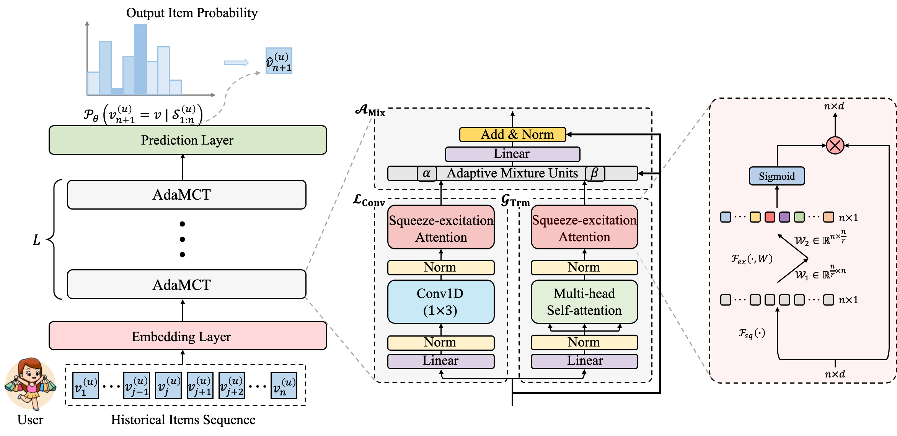
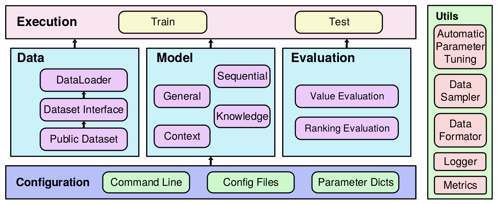

# AdaMCT: Adaptive Mixture of CNN-Transformer for Sequential Recommendation

This is our Pytorch implementation for the paper: "[AdaMCT: Adaptive Mixture of CNN-Transformer for Sequential Recommendation]()", which is based on a famous open-source framework [RecBole](#about-recbole).

## Overview

<p align="center">
  
  <br>
  <b>Figure</b>: AdaMCT Model Architecture.
</p>

## About RecBole
> [RecBole](https://recbole.io/) is developed based on Python and PyTorch for reproducing and developing recommendation algorithms in a unified,
comprehensive and efficient framework for research purpose.
RecBole's library includes 78 recommendation algorithms, covering four major categories:

+ General Recommendation
+ Sequential Recommendation
+ Context-aware Recommendation
+ Knowledge-based Recommendation

> RecBole designs a unified and flexible data file format, and provide the support for 28 benchmark recommendation datasets.
A user can apply the provided script to process the original data copy, or simply download the processed datasets
by RecBole's team.

<p align="center">
  
  <br>
  <b>Figure</b>: RecBole Overall Architecture
</p>

## Installation
RecBole works with the following operating systems:

* Linux
* Windows 10
* macOS X

RecBole requires Python version 3.7 or later.

RecBole requires torch version 1.7.0 or later. If you want to use RecBole with GPU,
please ensure that CUDA or cudatoolkit version is 9.2 or later.
This requires NVIDIA driver version >= 396.26 (for Linux) or >= 397.44 (for Windows10).

### Install from conda

```bash
conda install -c aibox recbole
```

### Install from pip

```bash
pip install recbole
```

### Install from source
```bash
git clone https://github.com/RUCAIBox/RecBole.git && cd RecBole
pip install -e . --verbose
```

## Quick-Start
With the source code, you can use the provided script for initial usage of RecBole's library:

For example, this script will run the BPR model on the ml-100k dataset by default.
```bash
python run_recbole.py
```
Typically, this example takes less than one minute. It will obtain the following output:

```
INFO ml-100k
The number of users: 944
Average actions of users: 106.04453870625663
The number of items: 1683
Average actions of items: 59.45303210463734
The number of inters: 100000
The sparsity of the dataset: 93.70575143257098%
INFO Evaluation Settings:
Group by user_id
Ordering: {'strategy': 'shuffle'}
Splitting: {'strategy': 'by_ratio', 'ratios': [0.8, 0.1, 0.1]}
Negative Sampling: {'strategy': 'full', 'distribution': 'uniform'}
INFO BPRMF(
    (user_embedding): Embedding(944, 64)
    (item_embedding): Embedding(1683, 64)
    (loss): BPRLoss()
)
Trainable parameters: 168128
INFO epoch 0 training [time: 0.27s, train loss: 27.7231]
INFO epoch 0 evaluating [time: 0.12s, valid_score: 0.021900]
INFO valid result:
recall@10: 0.0073  mrr@10: 0.0219  ndcg@10: 0.0093  hit@10: 0.0795  precision@10: 0.0088
...
INFO epoch 63 training [time: 0.19s, train loss: 4.7660]
INFO epoch 63 evaluating [time: 0.08s, valid_score: 0.394500]
INFO valid result:
recall@10: 0.2156  mrr@10: 0.3945  ndcg@10: 0.2332  hit@10: 0.7593  precision@10: 0.1591
INFO Finished training, best eval result in epoch 52
INFO Loading model structure and parameters from saved/***.pth
INFO best valid result:
recall@10: 0.2169  mrr@10: 0.4005  ndcg@10: 0.235  hit@10: 0.7582  precision@10: 0.1598
INFO test result:
recall@10: 0.2368  mrr@10: 0.4519  ndcg@10: 0.2768  hit@10: 0.7614  precision@10: 0.1901
```

If you want to change the arguments, such as ``gpu_id``, ``model``, ``learning_rate``, ``embedding_size``, ``dataset``, and ``config_files``,  just set the additional command arguments as you need:

```bash
python run_recbole.py\
        --model=[model_name]\
        --learning_rate=[0.0001]\
        --embedding_size=[128]\
        --dataset=['Amazon_Toys_and_Games']\
        --config_files=['config/Amazon_Toys_and_Games.yaml'] 
```

## AdaMCT

### Benchmarks Preparation

Please, download three widely used benchmarks from [RecSysDatasets](https://github.com/RUCAIBox/RecSysDatasets) or [Google Drive](https://drive.google.com/drive/folders/1ahiLmzU7cGRPXf5qGMqtAChte2eYp9gI) constructed by RecBole's team. Then, place the preprocessed files in `./dataset` like the following.

```
dataset
├── Amazon_Beauty
│   ├── Amazon_Beauty.inter
│   └── Amazon_Beauty.item
├── Amazon_Toys_and_Games
│   ├── Amazon_Toys_and_Games.inter
│   └── Amazon_Toys_and_Games.item
└── Amazon_Sports_and_Outdoors
    ├── Amazon_Sports_and_Outdoors.inter
    └── Amazon_Sports_and_Outdoors.item
```

### Training & Inference

Note that our experiments are conducted on a single NVIDIA A100 SXM4 80GB GPU. You can find our experimental logging files in `./exp_log`, including 
`AdaMCT-Amazon_Beauty-Jun-05-2023_01-47-32-ce1763`, `AdaMCT-Amazon_Sports_and_Outdoors-Jun-05-2023_04-49-07-5c1f03`, and `AdaMCT-Amazon_Toys_and_Games-Jun-05-2023_04-17-39-18a08b`. 

```bash
# Beauty
python run_recbole.py --gpu_id='0' --model=AdaMCT --dataset='Amazon_Beauty' --config_files='config/Amazon_Beauty.yaml'

# Toys
python run_recbole.py --gpu_id='1' --model=AdaMCT --dataset='Amazon_Toys_and_Games' --config_files='config/Amazon_Toys_and_Games.yaml' 

# Sports
python run_recbole.py --gpu_id='2' --model=AdaMCT --dataset='Amazon_Sports_and_Outdoors' --config_files='config/Amazon_Sports_and_Outdoors.yaml'
```

or 

```bash
bash run_adamct.sh
```

The terminal output of final results will be like (we report `test results` in our paper):

**Toys**
```bash
Mon 05 Jun 2023 07:15:56 INFO  best valid : OrderedDict([('recall@1', 0.2533), ('recall@5', 0.4599), ('recall@10', 0.5609), ('recall@20', 0.6785), ('ndcg@1', 0.2533), ('ndcg@5', 0.3621), ('ndcg@10', 0.3947), ('ndcg@20', 0.4243)])
Mon 05 Jun 2023 07:15:56 INFO  test result: OrderedDict([('recall@1', 0.2184), ('recall@5', 0.4132), ('recall@10', 0.5088), ('recall@20', 0.6252), ('ndcg@1', 0.2184), ('ndcg@5', 0.3203), ('ndcg@10', 0.3511), ('ndcg@20', 0.3804)])
```

**Beauty**
```bash 
Mon 05 Jun 2023 02:37:56 INFO  best valid : OrderedDict([('recall@1', 0.2519), ('recall@5', 0.4626), ('recall@10', 0.5621), ('recall@20', 0.6704), ('ndcg@1', 0.2519), ('ndcg@5', 0.363), ('ndcg@10', 0.3951), ('ndcg@20', 0.4224)])
Mon 05 Jun 2023 02:37:56 INFO  test result: OrderedDict([('recall@1', 0.2178), ('recall@5', 0.4207), ('recall@10', 0.5178), ('recall@20', 0.6314), ('ndcg@1', 0.2178), ('ndcg@5', 0.3241), ('ndcg@10', 0.3554), ('ndcg@20', 0.384)])

```
**Sports**
```bash
Mon 05 Jun 2023 08:40:20 INFO  best valid : OrderedDict([('recall@1', 0.222), ('recall@5', 0.469), ('recall@10', 0.6002), ('recall@20', 0.7392), ('ndcg@1', 0.222), ('ndcg@5', 0.3503), ('ndcg@10', 0.3926), ('ndcg@20', 0.4278)])
Mon 05 Jun 2023 08:40:20 INFO  test result: OrderedDict([('recall@1', 0.1862), ('recall@5', 0.4097), ('recall@10', 0.5412), ('recall@20', 0.6871), ('ndcg@1', 0.1862), ('ndcg@5', 0.3019), ('ndcg@10', 0.3444), ('ndcg@20', 0.3813)])

```

## Auto-tuning Hyperparameter 
Open `AdaMCT/hyper_adamct.test` and set several hyperparameters to auto-searching in parameter list. The following has two ways to search best hyperparameter:
* **loguniform**: indicates that the parameters obey the uniform distribution, randomly taking values from e^{-8} to e^{0}.
* **choice**: indicates that the parameter takes discrete values from the setting list.

Here is our hyperpatermeter searching space for `hyper_adamct.test`: 
```bash
learning_rate loguniform -8,0
hidden_size choice [16,32,64,96,128]
n_heads choice [2,4,8,16,32]
reduction_ratio choice [1,2,5,10,25]
kernel_size choice [3,5,7,9,11]
hidden_dropout_prob loguniform -1,0
attn_dropout_prob loguniform -1,0
hidden_act choice ["gelu","relu","swish","tanh","sigmoid"]
```
Set training command parameters as you need to run:
```
python run_hyper.py --model=[model_name] --dataset=[data_name] --config_files=xxxx.yaml --params_file=hyper.test
e.g.,
# Amazon Beauty
python run_hyper.py --gpu_id='0' --model=AdaMCT --dataset='Amazon_Beauty' --config_files='config/Amazon_Beauty.yaml' --params_file='hyper_adamct.test'

# Amazon Sports and Outdoors
python run_hyper.py --gpu_id='1' --model=AdaMCT --dataset='Amazon_Sports_and_Outdoors' --config_files='config/Amazon_Sports_and_Outdoors.yaml' --params_file='hyper_adamct.test'

# Amazon Toys and Games
python run_hyper.py --gpu_id='2' --model=AdaMCT --dataset='Amazon_Toys_and_Games' --config_files='config/Amazon_Toys_and_Games.yaml' --params_file='hyper_adamct.test'
```
Note that `--config_files=test.yaml` is optional, if you don't have any customize config settings, this parameter can be empty.

This processing maybe take a long time to output best hyperparameter and result:
```
e.g.,
running parameters:                                                                                                                    
{'embedding_size': 64, 'learning_rate': 0.005947474154838498, 'mlp_hidden_size': '[64,64,64]', 'train_batch_size': 512}                
  0%|                                                                                           | 0/18 [00:00<?, ?trial/s, best loss=?]
```

More information about hyperparameter tuning can be found in [docs](https://recbole.io/docs/user_guide/usage/parameter_tuning.html).

## License
RecBole uses [MIT License](./LICENSE). All data and code in this project can only be used for academic purposes.